# Windows Server Infrastructure Lab

## Objective
Build a small virtualized business network from scratch: deploy a Windows Server and two Windows client VMs, configure them to a business-ready standard, then stand up core infrastructure services (Active Directory, DHCP, Group Policy, DNS) and demonstrate they work correctly.

## Environment & Tools
- Oracle VirtualBox
- Windows Server 2022 (infrastructure server)
- Windows 10/11 (x2 clients)
- Internal/host-only virtual network

## Part 1: Virtual Environment & Internal Network

Set up three VMs (`Blinds-Trellis-Server`, `Blinds-Trellis-Client1`, `Blinds-Trellis-Client2`) on a shared internal network adapter so they could communicate without touching the host network.

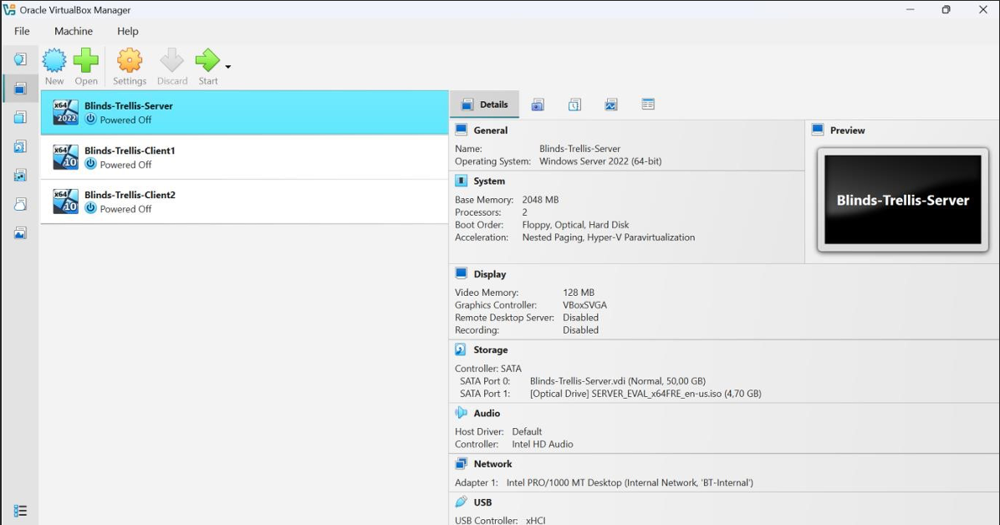

Server was assigned `192.168.10.10`, with Client1 on `.11` and Client2 on `.12`. Verified connectivity with `ping` between both clients and the server — 0% packet loss on all tests.
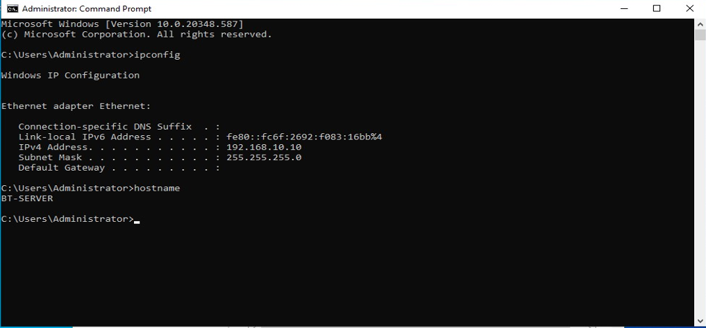
~Server ping sent 
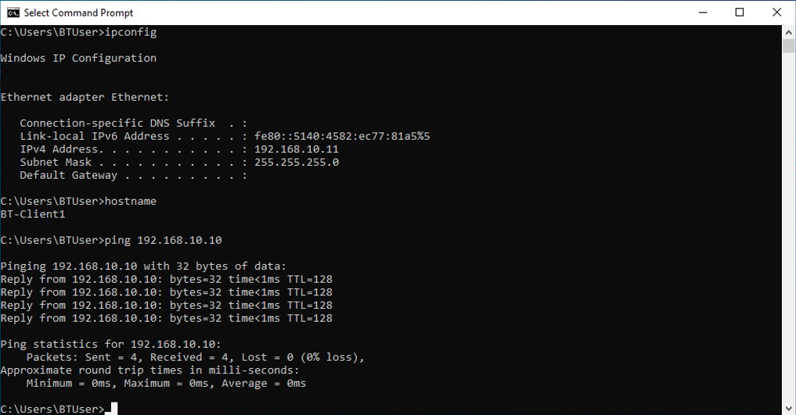
~Client1 ping sent 
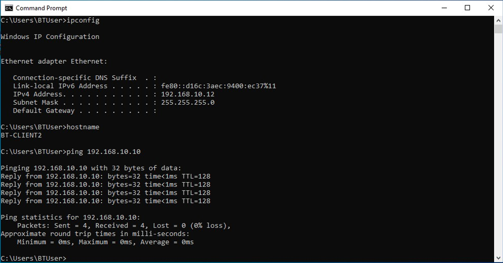
~Client2 ping sent 

All VM NIC's were configured so the communication between them is internal/host-only and I provided proof they ping each other.

## Part 2: Client Configuration

Configured both clients to a business-ready standard:
- Partitioned the disk into a 1/3 C: (system) / 2/3 D: (Business Data) split
- Enabled System Protection and created a restore point on each client
- Set the desktop background to the organisation logo

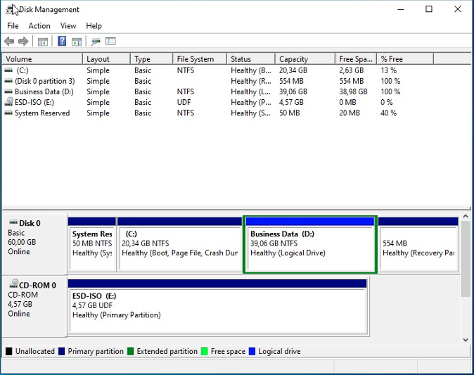

~The disks are partitioned

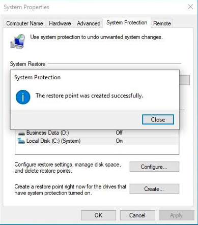

~System protection enabled and restore points created 

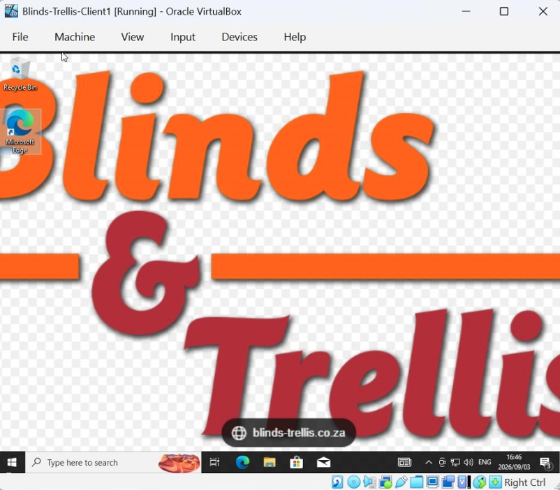

~Wallpaper changed!

## Part 3: Server Roles — Active Directory, DHCP, Group Policy, DNS

- **Active Directory Domain Services**: Promoted the server to a domain controller, created the domain, and joined at least one client.
- **DHCP**: Installed the DHCP role and configured an active scope (`192.168.10.0/24`), then confirmed both clients received leases automatically.
- **DNS break/fix**: Deliberately set an incorrect DNS value, demonstrated the resulting failure, then corrected it and confirmed resolution worked again.

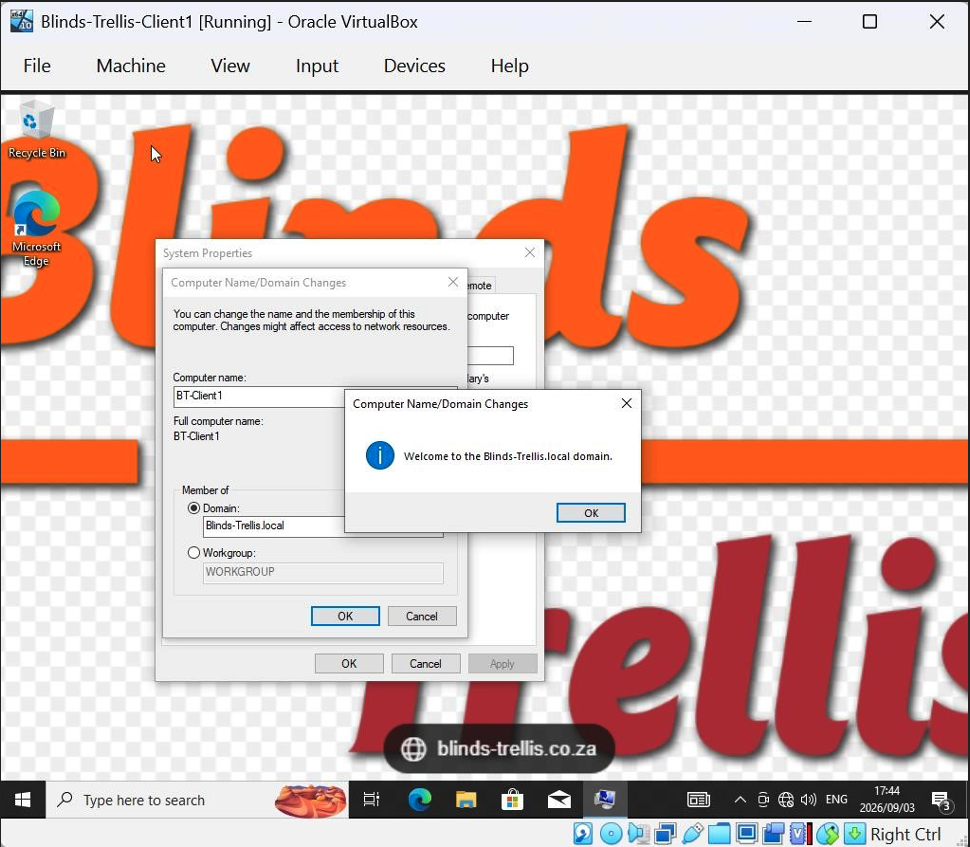
~Joining Confirmation pop up
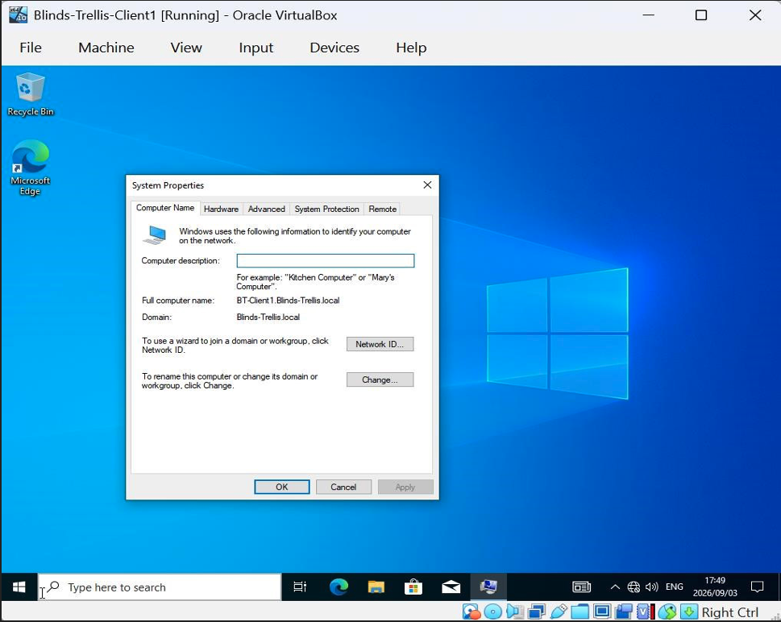

~This shows that the join persisted 

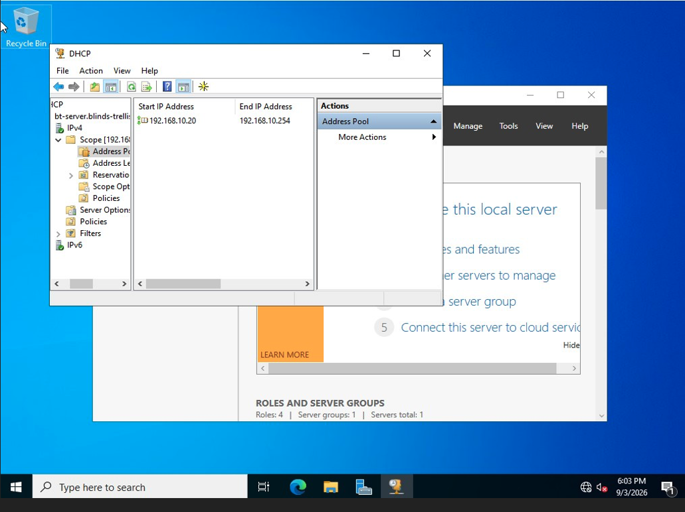

~DHCP Scope showing the address pool 

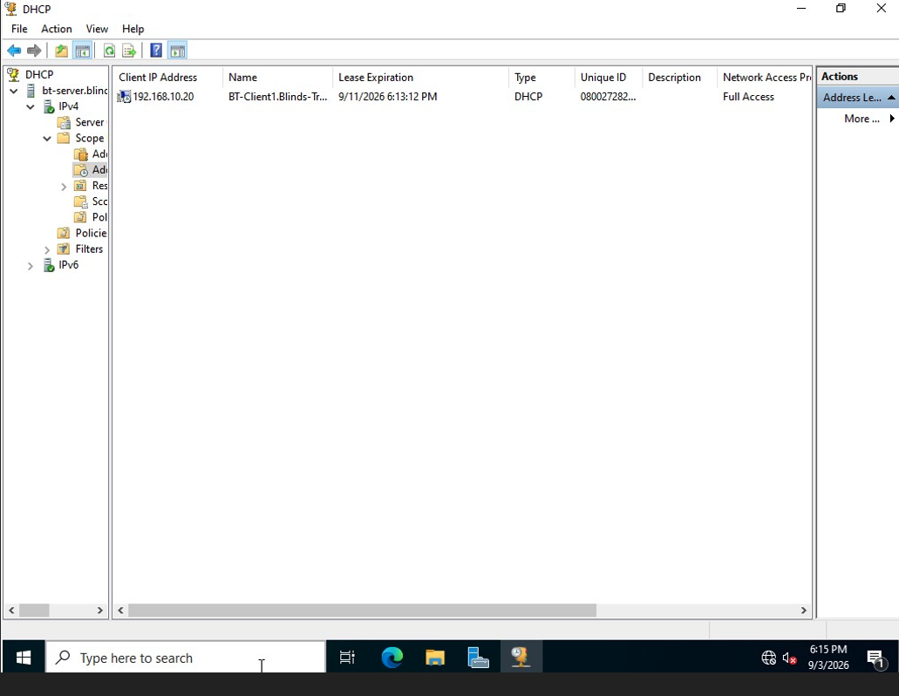

~Address leases showing BT-Client1 with a lease

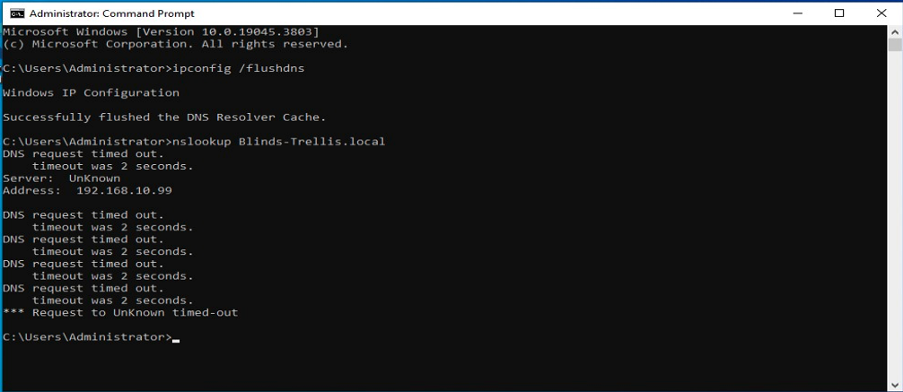
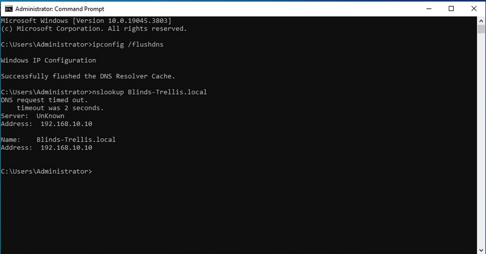

##Challenges

[What actually tripped you up — e.g. did the internal network not talk at first? Did AD promotion need a reboot you didn't expect? Did the DNS break/fix behave differently than predicted?]

## What I learned
[Your takeaway — e.g. how DHCP scopes eliminate manual IP management at scale, or how Group Policy centralizes configuration across a domain]
